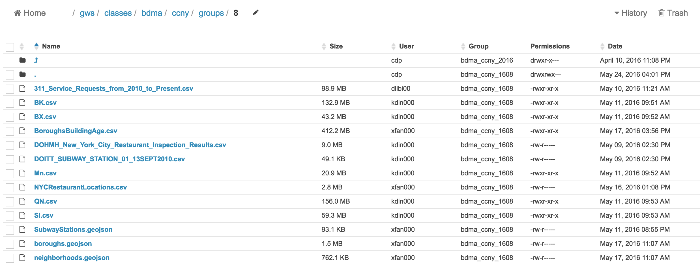
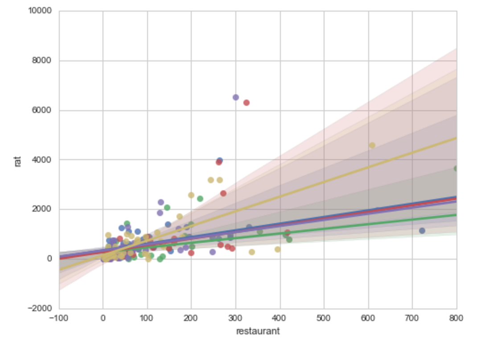
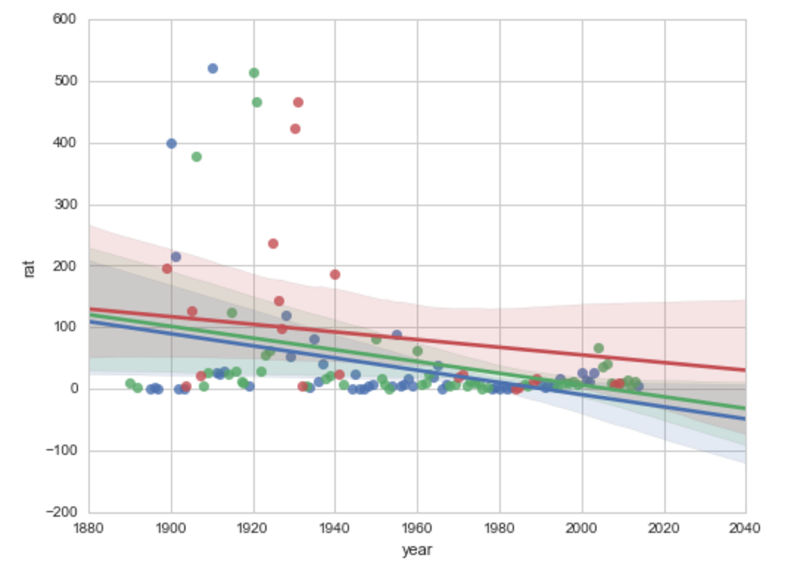
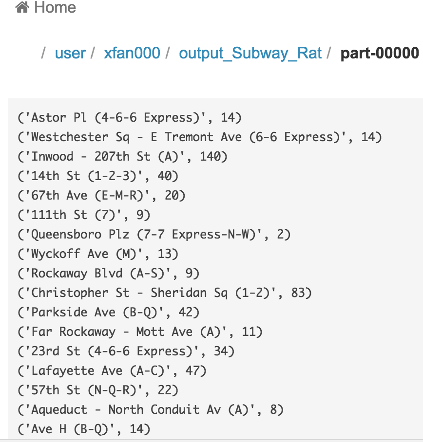
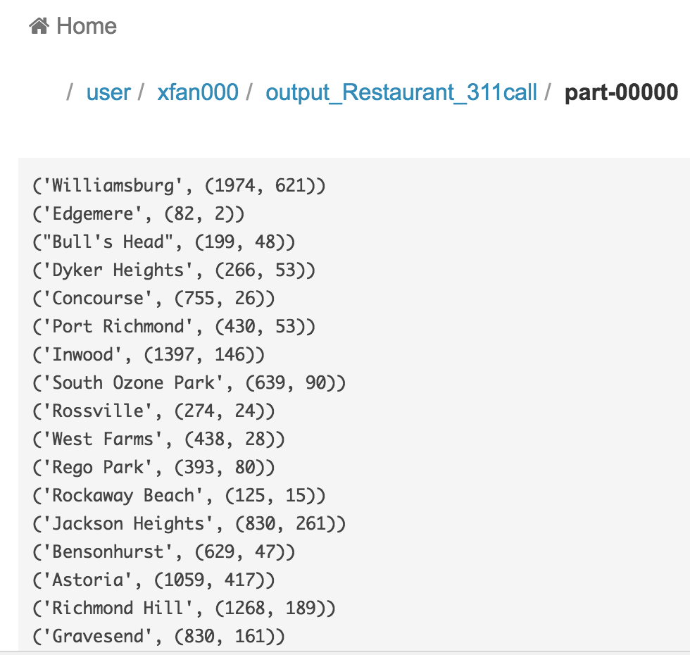

# Big-Data-Analysis-Rodent-Inspection-in-NYC 

##Motivation:

    Rodents and other pests are often a big problem for businesses in New York City. Pest complaints often lead to poor Health Inspection grades, poor customer satisfaction, and poor food hygiene. The goal of this project is to track their locations in NYC neighboorhoods by using the New York City 311 complaint data and sorting it for rodent inspections. Once we find the neighborhoods that rodents often congregate, the project will focus on creating a heatmap of the most common locations for rodents in the city. Hopefully, when businesses move to other neighboorhoods, they will use this data to see whether or not the area is optimal due to high rodent populations. 

##Objective:

* Short-term objective: 
   * To identify the rat prone area in New York city.
* Long-term objective:
   * To predict the rat migration.
   * To predict future rat prone area.

##Purpose:
* House buyers can have a better insight.
* tenants can have a better insight and prevent rats entering their house.
* Government can take action on reducing rat populaton in the right area.

##Tasks:
* Study rat compaint 311 calls in New York city.
* Study rat distribution changes in the past five years.
* Find the correlation between rats and subway stations.
* Find the correlation between rats and restaurants.
* Find the correlation between rats and building age.

##Data Sources:
* 311 Service Requests from 2010 to Present (6.4 GB of structured data as csv file)
   * https://nycopendata.socrata.com/Social-Services/311-Service-Requests-from-2010-to-Present/erm2-nwe9
* Rodent Inspection (225 MB of structured data as csv file) 
   * https://data.cityofnewyork.us/Health/Rodent-Inspection/p937-wjvj
* DOHMH New York City Restaurant Inspection Results (100 MB of structured data as csv file)  
   * https://nycopendata.socrata.com/Health/DOHMH-New-York-City-Restaurant-Inspection-Results/xx67-kt59
* Age of New York City buildings (200 MB of structured data as csv file) 
   * http://www1.nyc.gov/site/planning/data-maps/open-data/dwn-pluto-mappluto.page
* Name and location of all subway stations (50 KB of structured dats as csv file) 
   * https://data.cityofnewyork.us/Transportation/Subway-Stations/arq3-7z49

The photo below shows all the datasets we used on the NYU cusp big data server:

## Chart from our final result shows the positive correlation between number of restaurants and 311 call complaints for rats in neighborhood

## Chart from our final result shows the positive correlation between building age and number of 311 call complaints for rats in New York city

## Commands used to run this big data project:
#### Commands used to connect to NYU Cusp cluster:
ssh [YourCuspID]@gw.cusp.nyu.edu 
ssh cluster.cusp.nyu.edu  
git clone https://github.com/KhadeejaDin/Big-Data-Analysis-Rodent-Inspection-in-NYC.git 
cd Big-Data-Analysis-Rodent-Inspection-in-NYC/ 
chmod 777 submit_Subway.sh 
chmod 777 submit_Building.sh 
chmod 777 submit_Restaurant.sh 

./submit_Subway.sh subway.py /gws/classes/bdma/ccny/groups/8/311_Service_Requests_from_2010_to_Present.csv output_Subway_Rat Subway_Rat.txt 32 

The photo below shows part of the running result:

./submit_Building.sh Mn_BuildingAge_Rat.py /gws/classes/bdma/ccny/groups/8/311_Service_Requests_from_2010_to_Present.csv output_BuildingAge_Rat BuildingAge_Rat.txt 22 

./submit_Restaurant.sh Rat_Restaurant.py /gws/classes/bdma/ccny/groups/8/311_Service_Requests_from_2010_to_Present.csv /gws/classes/bdma/ccny/groups/8/NYCRestaurantlocations.csv output_Restaurant_311call Restaurant_311call.txt 64

The photo below shows part of the Running Result:

## Other commands used for handling files merge or read:
#### Command to mereg csv files:
cat *.csv >merge.csv

#### statement to read multiple csv files into one Rdd:
Rdd = sc.textFile("Restautant_311/*.csv")   // Restautant_311 folder contains all the csv files

##Contributors:
Khadeeja Din  
Xue Wei Fan  josephxwf@gmail.com 
Davide Libi-Bourne 
John Settineri
